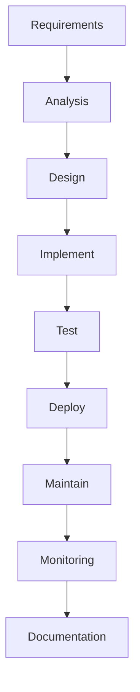

# data-pipeline-checklist

Checklist for creating a new data pipeline

## data engineering principles

## 1. Requirements

- requirements gathering
- documents acquire  
  - data dictionary
  - data schema
  - data contracts
- batch or real-time
- retry mechanism
- error reporting
- stakeholders and contact points
-

## 2. Analysis

## 3. Design

- tools
  - ETL/ELT tools (e.g. Apache Airflow, Luigi, Prefect)
  - Data integration tools (e.g. Apache Nifi, Talend)
  - Data transformation tools (e.g. dbt, Apache Spark)

## 4. Implement

- test-driven development (TDD)
- reusable functions

## 5. Test

- unit tests
- integration tests
- smoke tests
- test data
- test environment
- test cases

## 6. Deploy

- CI/CD pipeline
- Infrastructure as Code (IaC)
  - tools (e.g. Terraform, Ansible, CloudFormation)

## 7. Maintain & Document

- Knowledge base (e.g. confluence, Notion)

### source

- Platform
  - On-premise
  - Cloud

### sink

- Platform
  - On-premise
  - Cloud

## Data privacy

### PII data

- Contact informations
  - Name (First name, Last name)
  - Telephone number
  - Email address
  -

### Sensitive information

## Data security

### Hash (e.g. SHA256)

### Encryption

- Field-level encryption (e.g. AES-GCM, AES-CBC)
- File-level encryption (e.g. GPG, PGP)

## Time-based integration

### Batch

- schedule time

### Near real-time

### Real-time

## Constraints

### Rate limits

## Credentials

### User accounts

### Service accounts

## Monitoring

### Push notification

### Email notification

## Post-productions

### Historical loads

### notes

- data contracts
- data quality
- data transformations
