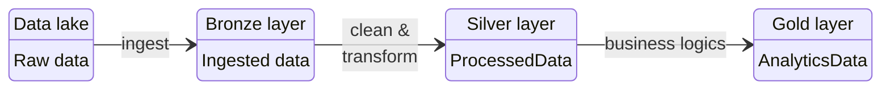
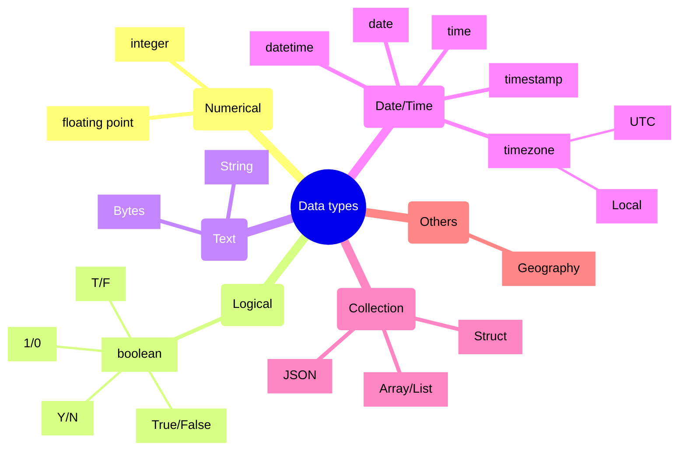
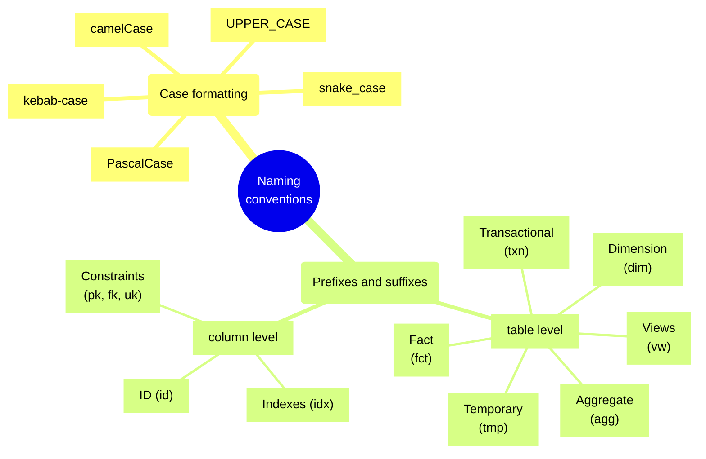

# Design

## Medalian architecture

```mermaid
stateDiagram-v2
  direction LR
  state "Data lake" as lake
  state "Raw data" as lake
  state "Bronze layer" as bronze
  state "Ingested data" as bronze 
  state "Silver layer" as silver
  state  "ProcessedData"  as silver
  state "Gold layer" as gold
  state "AnalyticsData" as gold
  
  lake --> bronze: ingest
  bronze --> silver: clean & <br>transform
  silver --> gold: business logics
```

## Data types

  
Click to expand

```mermaid
mindmap
  root((Data types))
    (Numerical)
      [integer]
      [floating point]
    (Logical)
      [boolean]
        [True/False]
        [T/F]
        [1/0]
        [Y/N]
    (Text)
      [String]
      [Bytes]
    (Date/Time)
      [date]
      [time]
      [datetime]
      [timestamp]
      [timezone]
        [UTC]
        [Local]
    (Collection)
      [Array/List]
      [Struct]
      [JSON]
    (Others)
      [Geography]
```

## Naming conventions

  
Click to expand

```mermaid
mindmap
  root((Naming<br/>conventions))
    (Case formatting)
      [snake_case]
      [kebab-case]
      [camelCase]
      [PascalCase]
      [UPPER_CASE]
    (Prefixes and suffixes)
      [table level] 
        [Fact<br>&lpar;fct&rpar;]
        [Dimension<br>&lpar;dim&rpar;]
        [Transactional<br>&lpar;txn&rpar;]
        [Aggregate<br>&lpar;agg&rpar;]
        [Temporary<br>&lpar;tmp&rpar;]
        [Views<br>&lpar;vw&rpar;]
      [column level]
        [ID &lpar;id&rpar;]
        [Indexes &lpar;idx&rpar;]
        [Constraints<br>&lpar;pk, fk, uk&rpar;]
```

