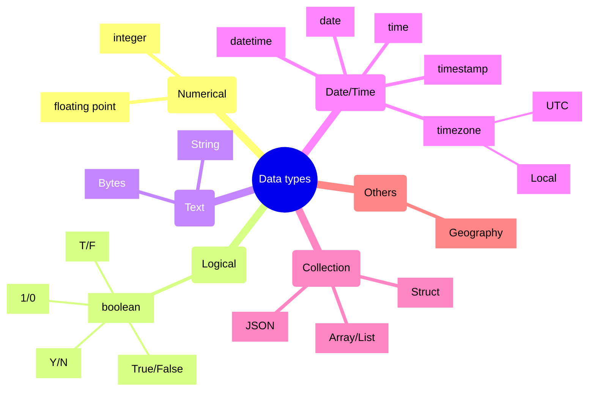
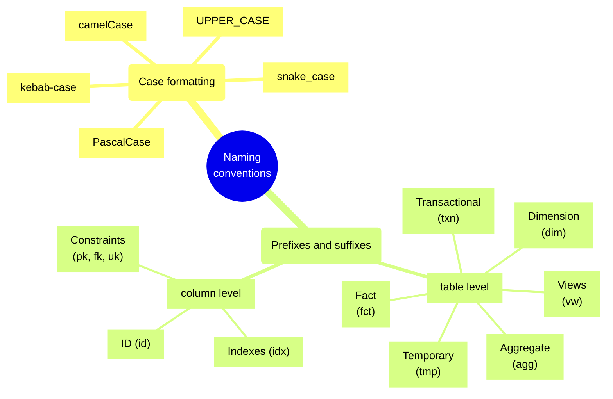

# Design

## Data types

```mermaid
mindmap
  root((Data types))
    (Numerical)
      [integer]
      [floating point]
    (Logical)
      [boolean]
        [True/False]
        [T/F]
        [1/0]
        [Y/N]
    (Text)
      [String]
      [Bytes]
    (Date/Time)
      [date]
      [time]
      [datetime]
      [timestamp]
      [timezone]
        [UTC]
        [Local]
    (Collection)
      [Array/List]
      [Struct]
      [JSON]
    (Others)
      [Geography]
```

## Naming conventions

```mermaid
mindmap
  root((Naming<br/>conventions))
    (Case formatting)
      [snake_case]
      [kebab-case]
      [camelCase]
      [PascalCase]
      [UPPER_CASE]
    (Prefixes and suffixes)
      [table level] 
        [Fact<br>&lpar;fct&rpar;]
        [Dimension<br>&lpar;dim&rpar;]
        [Transactional<br>&lpar;txn&rpar;]
        [Aggregate<br>&lpar;agg&rpar;]
        [Temporary<br>&lpar;tmp&rpar;]
        [Views<br>&lpar;vw&rpar;]
      [column level]
        [ID &lpar;id&rpar;]
        [Indexes &lpar;idx&rpar;]
        [Constraints<br>&lpar;pk, fk, uk&rpar;]
```
